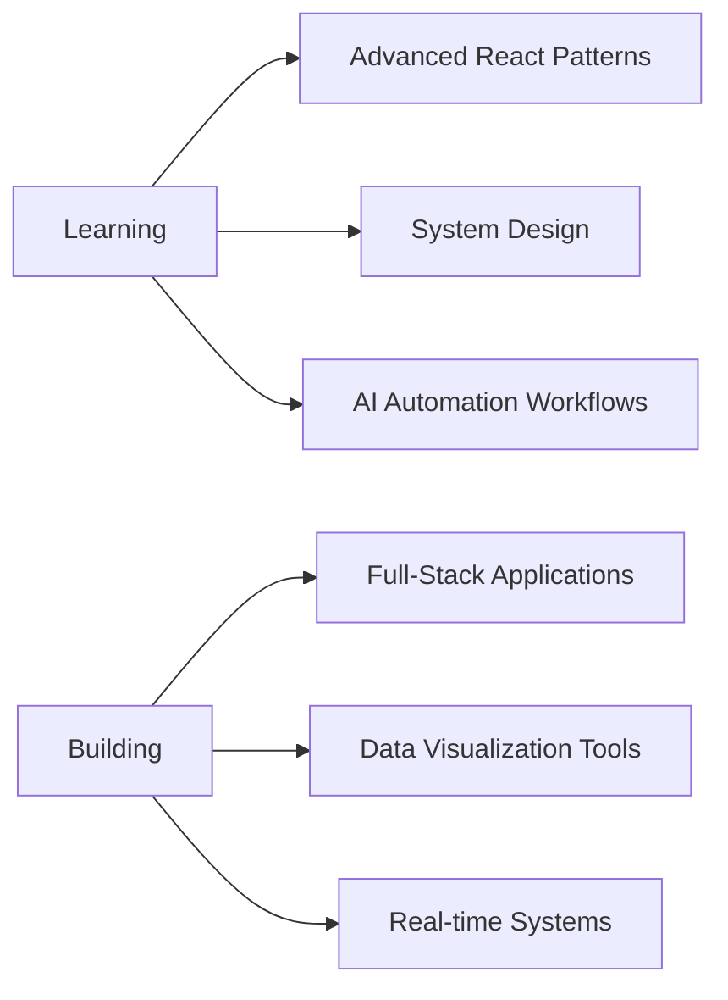

<!-- <h1 align="center">Hi 👋, I'm Sahil Chahal</h1>
<h3 align="center">A passionate Full Stack Developer from India</h3>


<p align="left">  </p>

<p align="left"> <a href="https://twitter.com/" target="blank"></a> </p>

- 🌱 I’m currently learning **React.js**

- 💬 Ask me about **C++, Python, Front-End Developement ,Backend Developement, React.js**

- 📫 How to reach me **Email: chahal.sahil0102@gmail.com**

<h3 align="left">Connect with me:</h3>
<p align="left">
<a href="https://linkedin.com/in/www.linkedin.com/in/sahil-chahal-4ba364295" target="blank"></a>
</p>

<h3 align="left">Languages and Tools:</h3>
<p align="left"> <a href="https://www.cprogramming.com/" target="_blank" rel="noreferrer">  </a> <a href="https://www.w3schools.com/cpp/" target="_blank" rel="noreferrer">  </a> <a href="https://www.w3schools.com/css/" target="_blank" rel="noreferrer">  </a> <a href="https://www.w3.org/html/" target="_blank" rel="noreferrer">  </a> <a href="https://developer.mozilla.org/en-US/docs/Web/JavaScript" target="_blank" rel="noreferrer">  </a> <a href="https://www.mathworks.com/" target="_blank" rel="noreferrer">  </a> <a href="https://www.mongodb.com/" target="_blank" rel="noreferrer">  </a> <a href="https://www.mysql.com/" target="_blank" rel="noreferrer">  </a> <a href="https://nodejs.org" target="_blank" rel="noreferrer">  </a> <a href="https://www.python.org" target="_blank" rel="noreferrer">  </a> <a href="https://reactjs.org/" target="_blank" rel="noreferrer">  </a> </p>


<p>&nbsp;</p>

<p></p> -->


<div align="center">


[](https://github.com/Sahil-Chahal)
[](https://linkedin.com/in/sahilchahal01)
[](mailto:chahal.sahil0102@gmail.com)
[](https://github.com/Sahil-Chahal)


</div>

---

<div align="center">

## 🌟 About Me

</div>

```javascript
const sahil = {
    location: "Jabalpur, India 🇮🇳",
    education: "B.Tech ECE @ IIIT Jabalpur | Aug 2023 - May 2027",
    currentFocus: "Full-Stack Development & AI Automation",
    currentlyLearning: ["Advanced React", "System Design", "AI Workflows"],
    interests: ["MERN Stack", "Data Visualization", "Real-time Systems"],
    askMeAbout: ["React.js", "Node.js", "Django", "MongoDB", "n8n"],
    funFact: "I lead 1000+ people events and code at midnight! 🎭⚡"
};
```

---

<div align="center">

## 🏆 Achievements & Recognition

</div>

<table align="center">
<tr>
<td align="center" width="50%">

**🎯 Social Summer of Code**  
*Open Source Contributor 2025*

Contributing to community-driven projects  
Implementing features & fixing bugs via GitHub

</td>
<td align="center" width="50%">

**🎭 Science of Spirituality**  
*Zonal Coordinator*

Leading creative teams nationally  
Managing events with **1000+ participants**

</td>
</tr>
<tr>
<td align="center" width="50%">

**🎬 Jazbaat - The Dramatics Society**  
*Co-Coordinator @ IIITDM Jabalpur*

Led flagship events (Tarang, Lahar, Filmy Night)  
Improved audience engagement & team coordination

</td>
<td align="center" width="50%">

**🚀 Zuno-by Foundit**  
*Campus Ambassador*

Built student engagement initiatives  
Promoted platform on campus (2023-2024)

</td>
</tr>
</table>

---

<div align="center">

## 💼 Featured Projects

</div>

<details open>
<summary><b>📊 Student Result Analysis System</b></summary>
<br>

**Tech Stack:** `Django` `Python` `HTML/CSS` `Chart.js`

- 📈 Performance analytics with subject-wise insights and predictions
- 📉 Interactive graphs and data visualizations
- 📄 Export functionality (PDF & Excel) for reports
- 🔐 Secure authentication with role-based access control

[](https://github.com/Sahil-Chahal)

</details>

<details>
<summary><b>📚 E-Library with Recommendation System</b></summary>
<br>

**Tech Stack:** `React` `Node.js/Django` `JavaScript` `CSS`

- 📖 Book browsing with rating and recommendation engine
- 🤖 Collaborative filtering for personalized suggestions
- 🎨 Responsive UI with smooth navigation across devices
- ⚡ Full-stack integration with optimized database operations

[](https://github.com/Sahil-Chahal)

</details>

<details>
<summary><b>💰 Personal Finance Tracker</b></summary>
<br>

**Tech Stack:** `MERN Stack` `Chart.js`

- 💵 Track income/expenses with intelligent categorization
- 📊 Interactive charts for spending trends visualization
- 🔔 Budget alerts and monthly summaries
- 📱 Mobile-responsive design for on-the-go access

[](https://github.com/Sahil-Chahal)

</details>

<div align="center">

**🔗 Explore More:** Building scalable web solutions with modern tech stacks

</div>

---

<div align="center">

## 🛠️ Tech Arsenal

</div>

<div align="center">

### Languages


### Frontend


### Backend


### Databases


### Tools & Automation


</div>

---

<div align="center">

## 📊 GitHub Analytics


</div>

---

<div align="center">

## 🎯 Current Focus



</div>

---

<div align="center">

## 💡 Code Philosophy

> *"First, solve the problem. Then, write the code. Because the best code is the code that never had to be written."*  
> — John Johnson

</div>

---

<div align="center">

## 🤝 Let's Connect!

I'm always open to interesting conversations and collaboration opportunities!

[](https://linkedin.com/in/sahilchahal01)
[](mailto:chahal.sahil0102@gmail.com)
[](https://github.com/Sahil-Chahal)
[](https://github.com/Sahil-Chahal)

</div>

---

<div align="center">

### 💭 Random Dev Quote


</div>

---

<div align="center">

### 🐍 Contribution Snake


</div>

---


<div align="center">

### ⭐️ From [Sahil Chahal](https://github.com/Sahil-Chahal)

**Thanks for visiting! Feel free to star ⭐ repositories you find interesting!**

</div>
